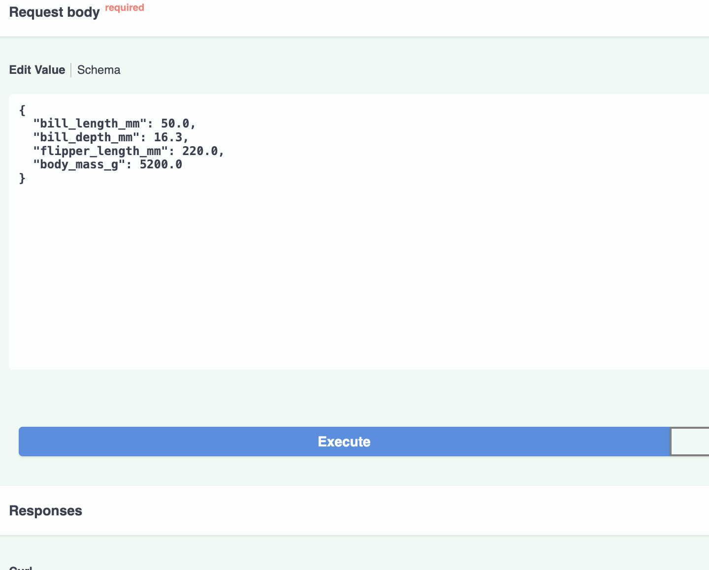
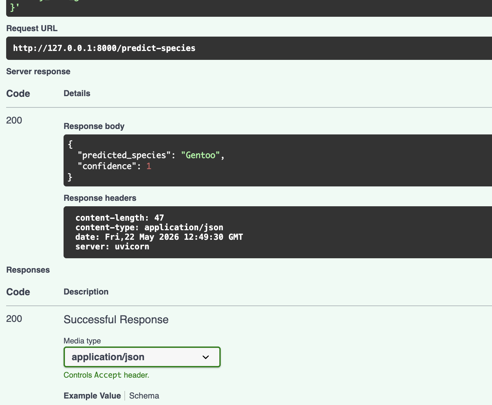
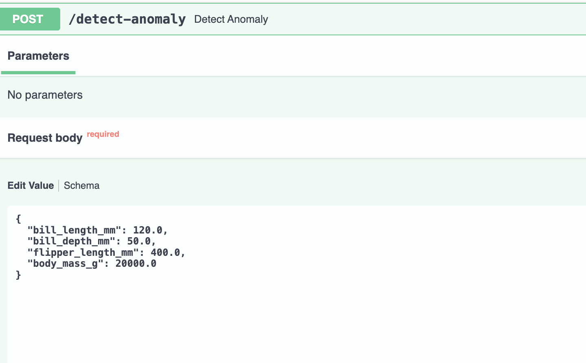
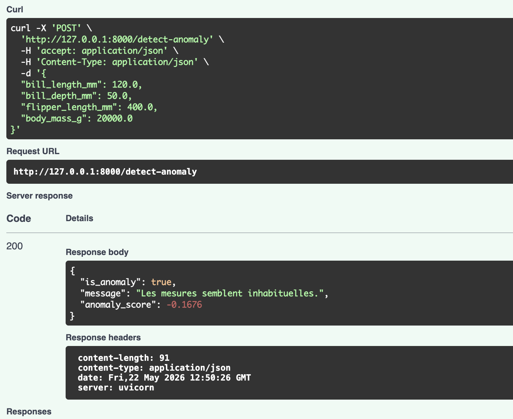

# Penguin AIOps Monitoring API

## Objectif du projet

Ce projet est un mini-projet de machine learning appliqué à un cas de monitoring.

L'objectif est de créer une API capable de :

1. prédire l'espèce d'un pingouin à partir de mesures biologiques ;
2. détecter si les mesures envoyées semblent normales ou inhabituelles.

Le projet s'inspire des problématiques AIOps : utiliser des données, entraîner des modèles, détecter des anomalies et exposer les résultats via une API.

## Lien avec l'AIOps

Même si le dataset est biologique, la logique technique est proche d'un système de monitoring d'infrastructure.

Les mesures des pingouins peuvent être comparées à des métriques techniques comme :

- CPU usage ;
- memory usage ;
- latency ;
- response time ;
- error rate.

Le modèle de détection d'anomalies permet d'identifier des mesures inhabituelles, comme un système AIOps pourrait détecter un comportement anormal dans une infrastructure ou une application.

## Dataset utilisé

Le projet utilise le dataset Palmer Penguins.

Les données contiennent notamment :

- l'espèce du pingouin ;
- la longueur du bec ;
- la profondeur du bec ;
- la longueur des nageoires ;
- la masse corporelle ;
- l'île ;
- le sexe.

Dans ce projet, seules les mesures numériques suivantes sont utilisées :

```python
colonnes_mesures = [
    "bill_length_mm",
    "bill_depth_mm",
    "flipper_length_mm",
    "body_mass_g"
]
```

La colonne cible pour la classification est :

```python
colonne_cible = "species"
```

## Compétences techniques montrées

Ce projet montre les compétences suivantes :

- Python ;
- pandas pour le traitement des données ;
- nettoyage de données ;
- machine learning supervisé ;
- détection d'anomalies ;
- validation simple d'un modèle ;
- sauvegarde de modèles avec joblib ;
- création d'une API avec FastAPI ;
- validation des entrées avec Pydantic ;
- documentation interactive avec Swagger UI.

## Approche d'apprentissage

Ce projet a été construit comme un projet d'apprentissage pour explorer les bases d'un pipeline AIOps.

Je me suis concentrée sur :

- la compréhension du dataset ;
- le nettoyage des valeurs manquantes ;
- l'entraînement d'un premier modèle supervisé ;
- la validation du modèle avec l'accuracy ;
- l'entraînement d'un modèle de détection d'anomalies ;
- l'exposition des modèles avec des endpoints FastAPI.

Le but n'est pas de créer un système parfait de production, mais de montrer une compréhension concrète du pipeline complet : données, modèle, validation et API.

## Structure du projet

```text
penguin-iaops/
├── app/
│   ├── data/
│   │   └── penguins.csv
│   ├── models/
│   │   ├── species_model.joblib
│   │   └── anomaly_model.joblib
│   ├── main.py
│   ├── schemas.py
│   └── train_models.py
├── doc/
│   └── images/
│       ├── speciespredictiontest.png
│       ├── speciespredictionresult.png
│       ├── anomalydetectiontest.png
│       └── anomalydetectionresult.png
├── requirements.txt
├── Dockerfile
├── .dockerignore
├── Makefile
├── Learningnotes.md
├── README_EN.md
└── README.md

```

## Installation

Créer un environnement virtuel :

```bash
python3 -m venv venv
```

Activer l'environnement virtuel :

```bash
source venv/bin/activate
```

Installer les dépendances :

```bash
pip install -r requirements.txt
```

## Entraîner les modèles

```bash
python3 app/train_models.py
```

Cette commande :

1. charge les données ;
2. nettoie les valeurs manquantes ;
3. prépare les données pour la classification ;
4. sépare les données en entraînement et test ;
5. entraîne un modèle RandomForestClassifier ;
6. calcule l'accuracy ;
7. entraîne un modèle IsolationForest ;
8. sauvegarde les modèles dans `app/models`.

## Résultat du modèle

Le modèle de classification obtient une précision d'environ :

```text
0.9565
```

Cela signifie qu'environ 95,65 % des prédictions sont correctes sur les données de test.

## Lancer l'API

```bash
uvicorn app.main:app --reload
```

Ouvrir ensuite :

```text
http://127.0.0.1:8000/docs
```

## Endpoints disponibles

### GET /

Vérifie que l'API fonctionne.

### POST /predict-species

Prédit l'espèce du pingouin à partir des mesures.

Exemple de données envoyées :

```json
{
  "bill_length_mm": 50.0,
  "bill_depth_mm": 16.3,
  "flipper_length_mm": 220.0,
  "body_mass_g": 5200.0
}
```

Exemple de réponse :

```json
{
  "predicted_species": "Gentoo",
  "confidence": 1
}
```

### POST /detect-anomaly

Détecte si les mesures semblent normales ou inhabituelles.

Exemple de données inhabituelles :

```json
{
  "bill_length_mm": 120.0,
  "bill_depth_mm": 50.0,
  "flipper_length_mm": 400.0,
  "body_mass_g": 20000.0
}
```

Exemple de réponse :

```json
{
  "is_anomaly": true,
  "message": "Les mesures semblent inhabituelles.",
  "anomaly_score": -0.1676
}
```

### GET /model-info

Donne des informations sur les modèles utilisés.

## Captures d'écran des tests API

### Test de prédiction d'espèce



### Résultat de prédiction d'espèce



### Test de détection d'anomalie



### Résultat de détection d'anomalie



## Interprétation des résultats

Le endpoint `/predict-species` retourne `Gentoo`, ce qui signifie que le modèle a identifié les mesures comme proches de l'espèce Gentoo.

Le endpoint `/detect-anomaly` retourne `is_anomaly: true` lorsque les mesures envoyées sont volontairement irréalistes. Le score négatif confirme que le modèle considère ces données comme inhabituelles.

## Limites du projet

Ce projet est un MVP pédagogique.

Limites actuelles :

- le dataset est petit ;
- il n'y a pas encore de dashboard ;
- il n'y a pas encore de tests automatisés ;
- le modèle n'est pas déployé en production ;
- la détection d'anomalies repose sur une estimation de 5 % de données atypiques.

## Améliorations possibles

- ajouter un dashboard avec Streamlit ;
- ajouter des tests unitaires ;
- ajouter une pipeline CI/CD ;
- ajouter un endpoint de monitoring ;
- comparer plusieurs modèles ;
- ajouter un rapport de classification plus détaillé.

## Docker

Build the Docker image:

```bash
docker build -t penguin-aiops-api .
```

Run the container:

```bash
docker run -p 8000:8000 penguin-aiops-api
```

Then open:

```text
http://127.0.0.1:8000/docs
```

## Pourquoi j'ai réalisé ce projet

J'ai réalisé ce projet après avoir analysé les compétences demandées pour le stage AI Ops.

L'offre mentionne notamment la détection d'anomalies, l'analyse prédictive, le monitoring d'infrastructure, la validation de modèles, la visualisation et la création d'endpoints API. J'ai donc voulu créer un projet court mais complet, capable de montrer ces blocs techniques de manière concrète.

J'ai choisi le dataset Palmer Penguins parce qu'il est scientifique, propre et facile à expliquer. Au lieu d'utiliser directement des métriques d'infrastructure, j'utilise des mesures biologiques comme version simplifiée de données de monitoring.

Le but est de montrer que je comprends la logique d'un pipeline AIOps :

- collecter des données ;
- nettoyer et préparer les données ;
- entraîner un modèle ;
- valider le modèle ;
- détecter des anomalies ;
- exposer le modèle avec une API ;
- tester l'API avec une documentation interactive.

Ce projet n'est pas présenté comme un système AIOps de production. C'est un MVP d'apprentissage conçu pour montrer ma motivation, ma curiosité technique et ma progression concrète.

## Sources

- Palmer Penguins dataset : https://allisonhorst.github.io/palmerpenguins/
- pandas documentation : https://pandas.pydata.org/docs/
- scikit-learn documentation : https://scikit-learn.org/stable/
- FastAPI documentation : https://fastapi.tiangolo.com/
- Pydantic documentation : https://docs.pydantic.dev/
- joblib documentation : https://joblib.readthedocs.io/